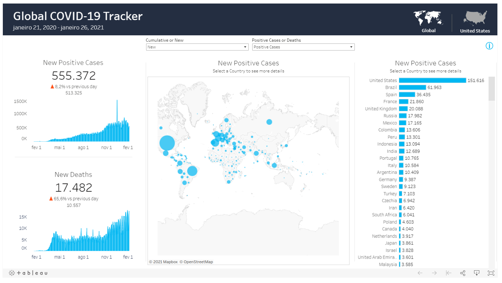

# Teste Lemobs

## Sobre o projeto

Foi criado um projeto em [ANGULAR](https://angular.io/) para a visualização de um painel de dados, na qual consta informações estatísticas sobre o COVID-19.
O painel foi obtido através de uma API da [Tableau](https://public.tableau.com/en-us/s/).

## Painel

<p align="center">
	
</p>

# Tecnologias utilizadas

## Front end
- HTML / CSS / JS / TypeScript
- Angular

<hr>

# Como executar o projeto

Pré-requisitos: NodeJS

```bash
# clonar repositório
git clone https://github.com/robsonshockwave/vaga1-lemobs

# entrar na pasta do projeto vaga1-lemobs
cd vaga1-lemobs

# instalar dependências
npm install

# executar o projeto
npm start
```

<hr>

<h6>Feito com carinho por <b>Robson de Arruda Silva</b>!</h6>
------------------------------------------------
